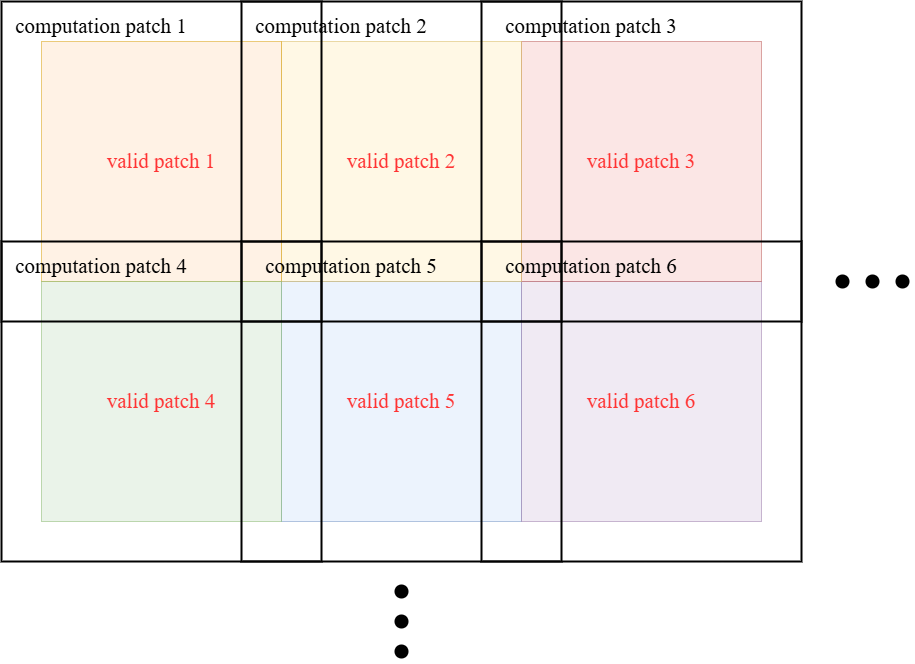
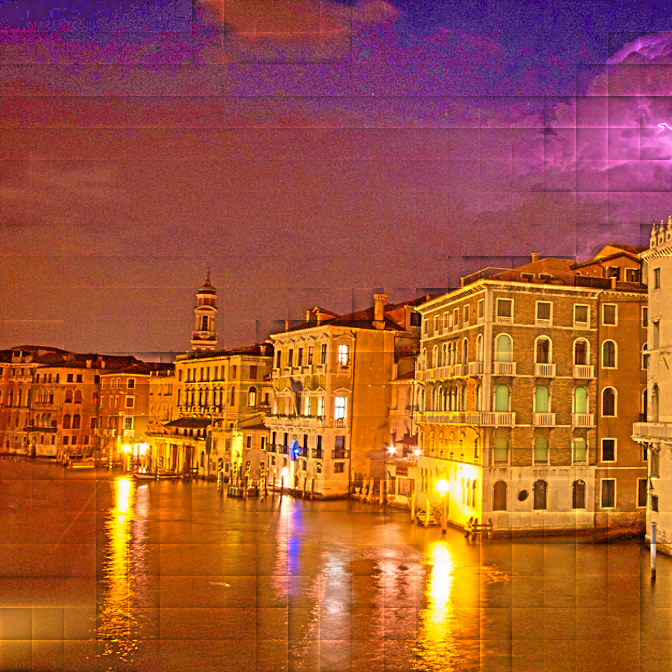
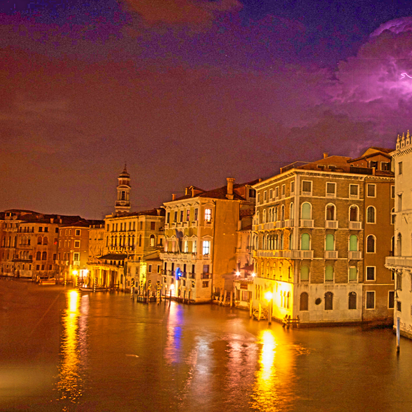
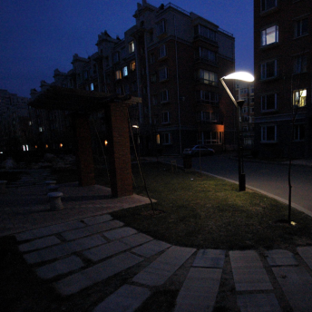
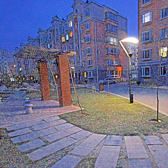
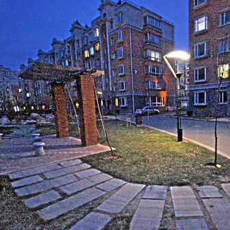
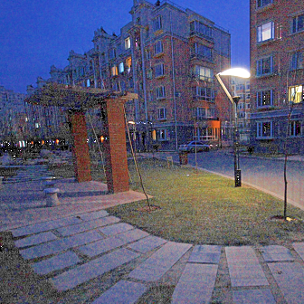

# Image_Exposure_Correction
A hardware-oriented implementation of illumination-map-based image exposure correction.
This project reformulates LIME into a patch-wise, memory-efficient pipeline suitable for hardware acceleration.


## Motivation

Illumination-based exposure correction methods derived from Retinex theory
provide interpretable and training-free enhancement.
However, existing algorithms assume full-frame processing and rely on
global intermediate buffers, which makes them inefficient for hardware acceleration.

This project bridges illumination-based enhancement and hardware-oriented design
by reorganizing the computation into a patch-wise dataflow
with carefully designed memory layouts and reusable floating-point units.

## Algorithm Overview

Under the Retinex model, an image is decomposed into reflectance and illumination.
Instead of directly estimating reflectance, we estimate an illumination map
and recover the enhanced image by division.

The algorithm consists of:
1. Max-RGB initialization
2. LIME-based illumination refinement (ALM solver)
3. Gamma-adjusted image recovery
4. Over-exposure handling by intensity inversion

## Image Partition Strategy

Direct full-frame processing is not hardware-friendly due to large memory requirements.
We adopt a patch-based processing strategy with overlap regions
to preserve illumination continuity at patch boundaries.

- Patch size: 32 × 32
- Valid region: 24 × 24
- Halo width: 4 pixels

<p align="center">
  
</p>

<div align="center">

<table>
  <tr>
    <th>Original</th>
    <th>Direct Partition</th>
    <th>Overlap Partition</th>
  </tr>
  <tr>
    <td align="center">
      
    </td>
    <td align="center">
      
    </td>
    <td align="center">
      
    </td>
  </tr>
</table>

</div>


## Hardware Architecture

The design adopts a time-multiplexed pipeline with a small number of FP64 units:

- 2 × FP64 multipliers (dual-lane float/ complex mode)
- 8 × FP64 adders (vector operations)
- 1 × FP64 reciprocal unit (Goldschmidt division)
- 1 × DelT (1-st order difference address controller)
- 1 × FFT (fft address controller)


.png)

## Experiment Result

From the experiments, we evaluate two numerical precisions in Python (FP16 and FP64).
We observe that FP16 precision leads to residual white pixels in the enhanced images.
This phenomenon arises because the lower numerical precision introduces quantization errors in the estimated illumination map, where small values may be rounded to zero.
During the image recovery stage, the enhanced image is computed as the original image divided by the estimated illumination map.
Consequently, pixels corresponding to near-zero illumination values are amplified excessively, resulting in saturation artifacts(white pixel) in the recovered image.

Thus, we implement the software and hardware in fp64 precision.

<div align="center">
<table>
  <tr>
    <th>Original</th>
    <th>Software FP16</th>
    <th>Software FP64</th>
    <th>Hardware</th>
  </tr>
  <tr>
    <td align="center">
      
    </td>
    <td align="center">
      
    </td>
    <td align="center">
      
    </td>
    <td align="center">
      
    </td>
  </tr>
</table>
</div>

## Performance

### 1. Timing

|Synthesis & Gate-Sim|APR & Post-Sim|
|:--:|:--:|
|3.5ns|6.3ns|
### 2. Area

|Synthesis| APR: Standard Cell Area| APR: Allocate Area| Core Utilization|
|:-:|:-:|:-:|:-:|
|     876129μm^2    |           907396 μm^2            |         1682037 μm^2         | 53.9%|

### 3. Power

The PrimeTime power analysis script is provided.  
Due to long runtime, full power simulation was not executed.

## Filelist

### 1. Software

Our final version `py/py_overlap_partition`.

run `tdenom.py` generate parameter matrix for software and hardware.

run `fft_pat.py` generate fft twiddle factor for hardware.

run `main.py` will generate software result and golden data for hardware.

```shell
py_overlap_partition
..\alm  # golden data for hw
..\dat  # paramter matrix for hw
..\imgs # original image
..\imgs_lime1 # underexposure enhaced image
..\imgs_lime2 # overexposure enhanced image
..\imgs_fusion # image fusion

..\main.py # main function
..\lime.py # LIME
..\alm.py  # Augamented Lagrange Multiplier
..\fft.py  # self-defined fft
..\fft_pat.py # generate fft param for hw
..\tdenom.py  # generate param matrix for hw
..\init_ap.py # initial illumination map
..\gamma_corr.py # gamma correction
..\helper.py # dump the hw golden data
```

### 2. Hardware
```shell
./hdl # top module
./apr # auto placement and route
./sim # pre-sim and gate-sim
./spyglass # spyglass check for hdl
./syn # synthesis scirpt
./submodule # submodule test env
./primetime # power analysis
```

<!-- 
## Test Pattern
run main.py

The test pattern is in the following file list, verilog testbench will reading these bmp file to generate golden data.

Each golden data is 32x32x3 bmp dile.
```
imgs_lime1
..\input_image
..\initial_illum_map
..\refined_illum_map
..\gamma_illum_map
..\enhanced_image
imgs_lime2
..\input_image
..\initial_illum_map
..\refined_illum_map
..\gamma_illum_map
..\enhanced_image
```

## Testbench
```
* note: Loop idx depend on the patch number = 28(0-27, 0-27)
Loop i{ 
    Loop j{
        1. read input image patch into sram_A
        (3126 byte = 54 byte(head) + 3072 byte(data))
        Reference the HW4 sram task
        2. The golden data may be(depends on the tcl), 
        the golden should also only capture l3072 data
        byte from bmp
        {
        * note: here may have 50 iteration(correspond), 
        to lime.py, but I think we can do only one 
        iteration now, just for first round check.
        - initial_illum_map
        - refined_illum_map
        - gamma_illum_map
        - enhanced_image
        }
        - ...image fusion, comming soon
    }
}
```

## Memory Allocate

### SRAM A
Used to store a patch of input image(32x32 pixel, each pixel have (R,G,B), range from (0,255) 8-bit), so the sram size is 32x32x24-bit = 3072-byte(discard the 54-byte head).

SRAM A is devide into 4-bank. The data allocate as:

bmp image = 32x32x3 byte 

Matrix(row, col), each element(pixel) is 3-byte(RGB): 
```
( 0,0) ( 0,1) ... ( 0,31)
( 1,0) ( 1,1) ... ( 1,31)
( 2,0) ( 2,1) ... ( 2,31)
...
(31,0) (31,1) ... (31,31)
```
```
addr-0: 
    bank0: ( 0,0)
    bank1: ( 0,1)
    bank2: ( 0,2)
    bank3: ( 0,3)
addr-1:
    bank0: ( 0,4)
    bank1: ( 0,5)
    bank2: ( 0,6)
    bank3: ( 0,7)
...
addr-255:
    bank0: (31,28)
    bank1: (31,29)
    bank2: (31,30)
    bank3: (31,31)
```

### SRAM B
Used to store init layer (32x32 pixel, each pixel have one channel, fp64 format , so the sram size is 32x32x64-bit = 65536-bit).

SRAM B is devide into 4-bank. The data allocate as:

bmp image = 32x32x8 byte 

Matrix(row, col), each element(pixel) is 8-byte(fp64): 
```
( 0,0) ( 0,1) ... ( 0,31)
( 1,0) ( 1,1) ... ( 1,31)
( 2,0) ( 2,1) ... ( 2,31)
...
(31,0) (31,1) ... (31,31)
```
```
addr-0: 
    bank0: ( 0,0)
    bank1: ( 0,1)
    bank2: ( 0,2)
    bank3: ( 0,3)
addr-1:
    bank0: ( 0,4)
    bank1: ( 0,5)
    bank2: ( 0,6)
    bank3: ( 0,7)
...
addr-255:
    bank0: (31,28)
    bank1: (31,29)
    bank2: (31,30)
    bank3: (31,31)
```
 -->

## Run simulation
```shell
1. upload the this repo into mobaxterm
2. > cd Image_Exposure_correction/py/py_overlap_partition
3. > python3 -m pip install --user pillow numpy
4. > python3 tdenom.py
4. > python3 fft_pat.py
5. > python3 main.py
6. > cd Image_Exposure_correction/sim
7. > vim run_sim.sh
8. > :set ff=unix
9. > :wq
10. > sh run_sim.sh
```

<!-- 
## Dataflow

### Step1: Initial Illumination Map

Input image(680x680x3 pixel), divided into 28x28 overlap patch and store in SRAM-A. The SRAM-A store one patch(32x32x3 pixel) with 4-bank.

Compare R,G,B in one pixel, choose the largest value and multiply with 255^-1. Then store in SRAM-B, the SRAM-B size is  32x32x1 pixel, 64-bit/pexel, SRAM-B have 4-bank too.

### Step2: ALM

Solve the ALM with iteration(fsm will have feedback state). -->
