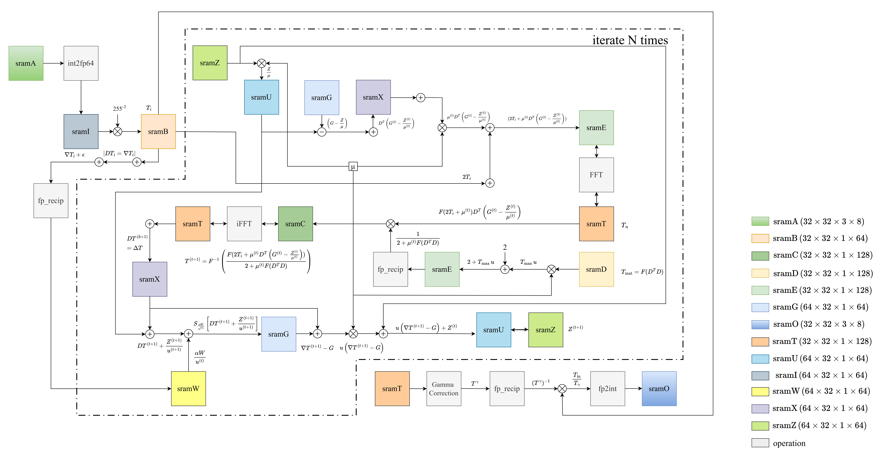

# Image_Exposure_Correction
A hardware implementation of illumination-map-based image enhancement, featuring LIME estimation, dual illumination correction (forward + inverted images), and multi-exposure fusion for robust under/over-exposure correction.



## Test Pattern
run main.py

The test pattern is in the following file list, verilog testbench will reading these bmp file to generate golden data.

Each golden data is 32x32x3 bmp dile.
```
imgs_lime1
..\input_image
..\initial_illum_map
..\refined_illum_map
..\gamma_illum_map
..\enhanced_image
imgs_lime2
..\input_image
..\initial_illum_map
..\refined_illum_map
..\gamma_illum_map
..\enhanced_image
```

## Testbench
```
* note: Loop idx depend on the patch number = 28(0-27, 0-27)
Loop i{ 
    Loop j{
        1. read input image patch into sram_A
        (3126 byte = 54 byte(head) + 3072 byte(data))
        Reference the HW4 sram task
        2. The golden data may be(depends on the tcl), 
        the golden should also only capture l3072 data
        byte from bmp
        {
        * note: here may have 50 iteration(correspond), 
        to lime.py, but I think we can do only one 
        iteration now, just for first round check.
        - initial_illum_map
        - refined_illum_map
        - gamma_illum_map
        - enhanced_image
        }
        - ...image fusion, comming soon
    }
}
```

## Memory Allocate

### SRAM A
Used to store a patch of input image(32x32 pixel, each pixel have (R,G,B), range from (0,255) 8-bit), so the sram size is 32x32x24-bit = 3072-byte(discard the 54-byte head).

SRAM A is devide into 4-bank. The data allocate as:

bmp image = 32x32x3 byte 

Matrix(row, col), each element(pixel) is 3-byte(RGB): 
```
( 0,0) ( 0,1) ... ( 0,31)
( 1,0) ( 1,1) ... ( 1,31)
( 2,0) ( 2,1) ... ( 2,31)
...
(31,0) (31,1) ... (31,31)
```
```
addr-0: 
    bank0: ( 0,0)
    bank1: ( 0,1)
    bank2: ( 0,2)
    bank3: ( 0,3)
addr-1:
    bank0: ( 0,4)
    bank1: ( 0,5)
    bank2: ( 0,6)
    bank3: ( 0,7)
...
addr-255:
    bank0: (31,28)
    bank1: (31,29)
    bank2: (31,30)
    bank3: (31,31)
```

### SRAM B
Used to store init layer (32x32 pixel, each pixel have one channel, fp64 format , so the sram size is 32x32x64-bit = 65536-bit).

SRAM B is devide into 4-bank. The data allocate as:

bmp image = 32x32x8 byte 

Matrix(row, col), each element(pixel) is 8-byte(fp64): 
```
( 0,0) ( 0,1) ... ( 0,31)
( 1,0) ( 1,1) ... ( 1,31)
( 2,0) ( 2,1) ... ( 2,31)
...
(31,0) (31,1) ... (31,31)
```
```
addr-0: 
    bank0: ( 0,0)
    bank1: ( 0,1)
    bank2: ( 0,2)
    bank3: ( 0,3)
addr-1:
    bank0: ( 0,4)
    bank1: ( 0,5)
    bank2: ( 0,6)
    bank3: ( 0,7)
...
addr-255:
    bank0: (31,28)
    bank1: (31,29)
    bank2: (31,30)
    bank3: (31,31)
```


## Preparing Pattern Files

*note: start from step4

### 1. Create the directory
```
./sim/pat
```
### 2. Copy all images from the following folders into ./sim/pat:
```
py/py_overlap_partition/imgs_lime1
py/py_overlap_partition/imgs_lime2
```
### 3. Rename all image files: Pad both indices to two digits
For example
```
0_0 -> 00_00
```
### 4. Run simulation
```shell
1. upload the this repo into mobaxterm
2. > cd Image_Exposure_correction/py/py_overlap
3. > python3 -m pip install --user pillow numpy
4. > python3 tdenom.py
5. > python3 main.py
6. > cd Image_Exposure_correction/sim
7. > vim run_sim.sh
8. > :set ff=unix
9. > :wq
10. > sh run_sim.sh
```


## Dataflow

### Step1: Initial Illumination Map

Input image(680x680x3 pixel), divided into 28x28 overlap patch and store in SRAM-A. The SRAM-A store one patch(32x32x3 pixel) with 4-bank.

Compare R,G,B in one pixel, choose the largest value and multiply with 255^-1. Then store in SRAM-B, the SRAM-B size is  32x32x1 pixel, 64-bit/pexel, SRAM-B have 4-bank too.

### Step2: ALM

Solve the ALM with iteration(fsm will have feedback state).
